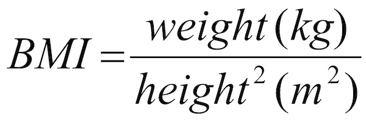

# BMI_2.0
### Write a program that interprets the Body Mass Index (BMI) based on a user's weight and height.

It should tell them the interpretation of their BMI based on the BMI value.  
<ul>
    <li>Under 18.5 they are underweight</li>
    <li>Over 18.5 but below 25 they have a normal weight</li>
    <li>Over 25 but below 30 they are slightly overweight</li>
    <li>Over 30 but below 35 they are obese</li>
    <li>Above 35 they are clinically obese.</li>
</ul>

 The BMI is calculated by dividing a person's weight (in kg) by the square of their height (in m): 

Warning you should round the result to the nearest whole number.  The interpretation message needs to include the words in the list from the interpretations above.  e.g. underweight, normal weight, overweight, obese, clinically obese.
